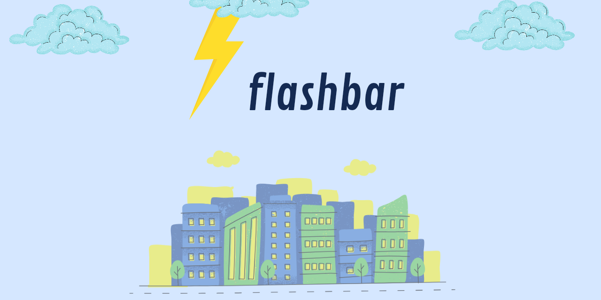

<p align="center">
  
</p>

<h2 align="center"><b>flashbar</b></h2>
<p align="center">
<b>Alternatif snackbar dan toast, canggih, dapat disesuaikan, cantik dan mudah digunakan</b>
<p><br>

<p align="center">
<!-- Latest release -->

<!-- Github Repo size -->

<!-- Build with Kotlin -->

<!-- License -->

</p>

## Baca dalam bahasa Inggris

- [English](./README.md)

## Tentang Flashbar
Pustaka untuk menampilkan pesan sebagai alternatif snackbar dan toast, yang canggih, mudah disesuaikan, dan mudah digunakan.
Berdasarkan [Flashbar (AndroidIDE)](https://github.com/AndroidIDEOfficial/AndroidIDE/tree/dev/utilities%2Fflashbar) yang berdasarkan [Flashbar (aritraroy)](https://github.com/aritraroy/Flashbar)

## Konfigurasi

1. Letakkan kode ini di settings.gradle.kts (root kotlin dsl) di ```repositories``` 
```kotlin.kts
  dependencyResolutionManagement {
    repositories {
      // contoh
      maven {
        url = uri("https://jitpack.io")
      }
    }
  }
```
jika menggunakan groovy dsl
```groovy
  repositories {
    maven { url 'https://jitpack.io' }
  }
```
2. Masukkan dependensi ke dalam build.gradle.kts (app/build.gradle.kts kotlin dsl)
di dalam blok ```dependencies```

```kotlin.kts
implementation("com.github.hasanelfalakiy:flashbar:${version}")
```
jika menggunakan groovy dsl
```groovy
implementation 'com.github.hasanelfalakiy:flashbar:${version}'
```

## Dokumentasi

- [Dokumentasi](https://hasanelfalakiy.github.io/flashbar/)

## Penggunaan

dalam proses


## Ingin berkontribusi?

> Jika Anda ingin berkontribusi, silakan fork repositori ini, klon ke mesin lokal Anda, buat perubahan, dorong, lalu kirim permintaan tarik ke repositori ini

## Kontak kami

- [Telegram](https://t.me/moonelfalakiy)
- [Grup diskusi telegram](https://t.me/moonlight_studio01/9)

## Lisensi

```
flashbar

Copyright (C) 2024  Andi Hasan Ashari

flashbar is free software: you can redistribute it and/or modify
it under the terms of the GNU General Public License as published by
the Free Software Foundation, either version 3 of the License, or
(at your option) any later version.

flashbar is distributed in the hope that it will be useful,
but WITHOUT ANY WARRANTY; without even the implied warranty of
MERCHANTABILITY or FITNESS FOR A PARTICULAR PURPOSE.  See the
GNU General Public License for more details.

You should have received a copy of the GNU General Public License
along with flashbar.  If not, see <https://www.gnu.org/licenses/>.

```
Laporkan kepada kami jika ada yang melanggar ketentuan Lisensi, baik dengan mengajukan masalah atau menulis pesan kepada kami secara langsung.
